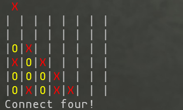

# ConnectFour

## Project Overview

This is a Connect Four game implementation with both a server and client component written in Go. The project implements a full-featured online multiplayer Connect Four game with user authentication, game state management, and a console-based UI.

## Architecture

The project follows a clean architecture pattern with clear separation of concerns:

1. **Client-Server Architecture**:
    - REST API server for game logic and state management
    - Console-based client using the BubbleTea and LipGloss libraries for UI

2. **Key Components**:
    - Database layer (MariaDB) for persisting users and games
    - JWT authentication for secure API access
    - RESTful API endpoints for game operations
    - Terminal-based UI client

## Technical Highlights

### Backend (Server)

1. **API Framework**: Uses Chi router for HTTP routing with well-organized endpoints
2. **Authentication**: JWT-based authentication system
3. **Database**: MariaDB with a simple schema for users and games
4. **Containerization**: Docker Compose setup for easy deployment
5. **Game Logic**: Clean implementation of Connect Four rules

### Frontend (Client)

1. **TUI Framework**: Uses BubbleTea and LipGloss for terminal UI
2. **Authentication**: Supports JWT authentication with optional credential storage
3. **API Integration**: Well-structured API client for server communication

## Project Structure

The project follows Go best practices with a clear organizational structure:

```
connectfour/
├── cmd/                    # Application entry points
│   ├── client/             # Client application
│   └── server/             # Server application
├── internal/               # Internal application code
│   ├── client/             # Client implementation
│   ├── db/                 # Database interfaces
│   ├── handlers/           # API handlers
│   ├── model/              # Domain models
│   └── service/            # Business logic services
├── sql/                    # Database schemas
├── doc/                    # Documentation
├── build/                  # Build artifacts
└── compose.yaml            # Docker Compose configuration
```

## Database Schema

The database schema is simple but effective:

1. **User Table**: Stores user information and authentication details
2. **Game Table**: Stores game state, player information, and board state

## API Endpoints

The server exposes a RESTful API with these endpoints:

1. **Authentication**:
    - POST `/login`: User login
    - POST `/register`: User registration

2. **Game Management** (JWT protected):
    - GET `/games`: List open games
    - GET `/games/my`: List user's games
    - POST `/games`: Create a new game
    - GET `/games/{key}`: Get game state
    - POST `/games/{key}/join`: Join an existing game
    - POST `/games/{key}/play`: Make a move in a game

For more information about these endpoints and how to update the API docs, view the [Swagger/OpenAPI docs](swagger_README.md).


## Deployment

The project uses Docker Compose for deployment with:
- MariaDB container for the database
- Application container for the server
- Volume configuration for data persistence
- Secret management for database credentials

## Code Quality

Claude AI says that the code appears to be of high quality :) 

- Comprehensive test coverage
- Clean separation of concerns
- Good use of Go idioms and patterns
- Proper error handling
- Clear naming conventions




